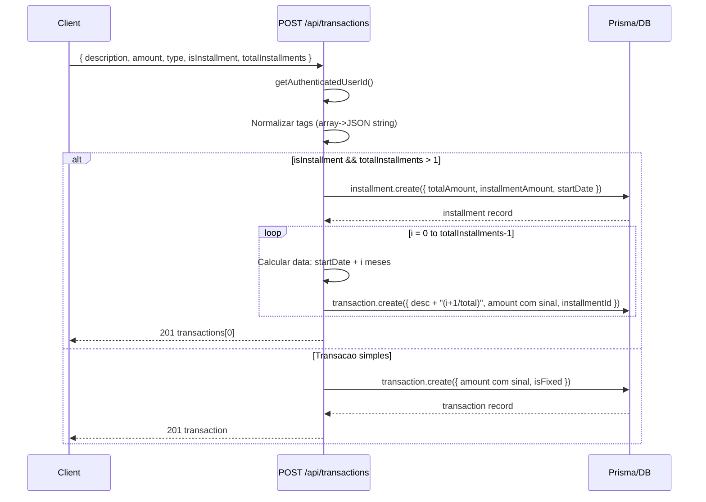
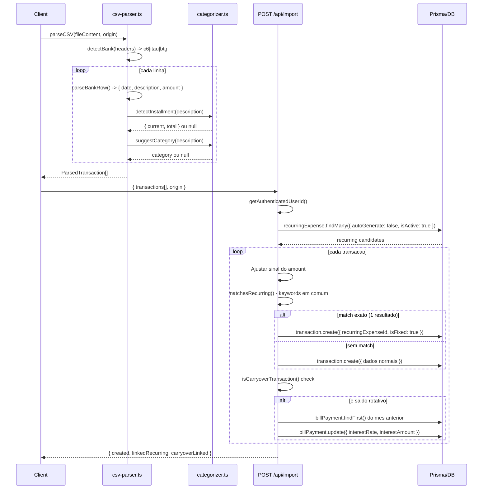
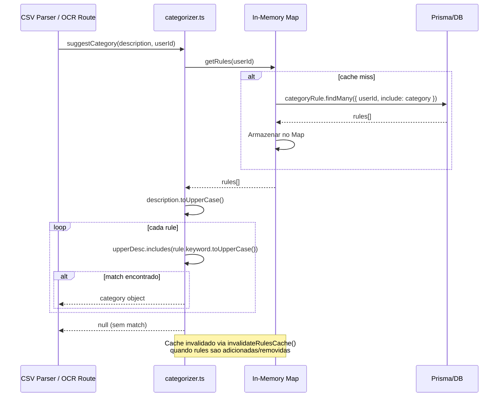
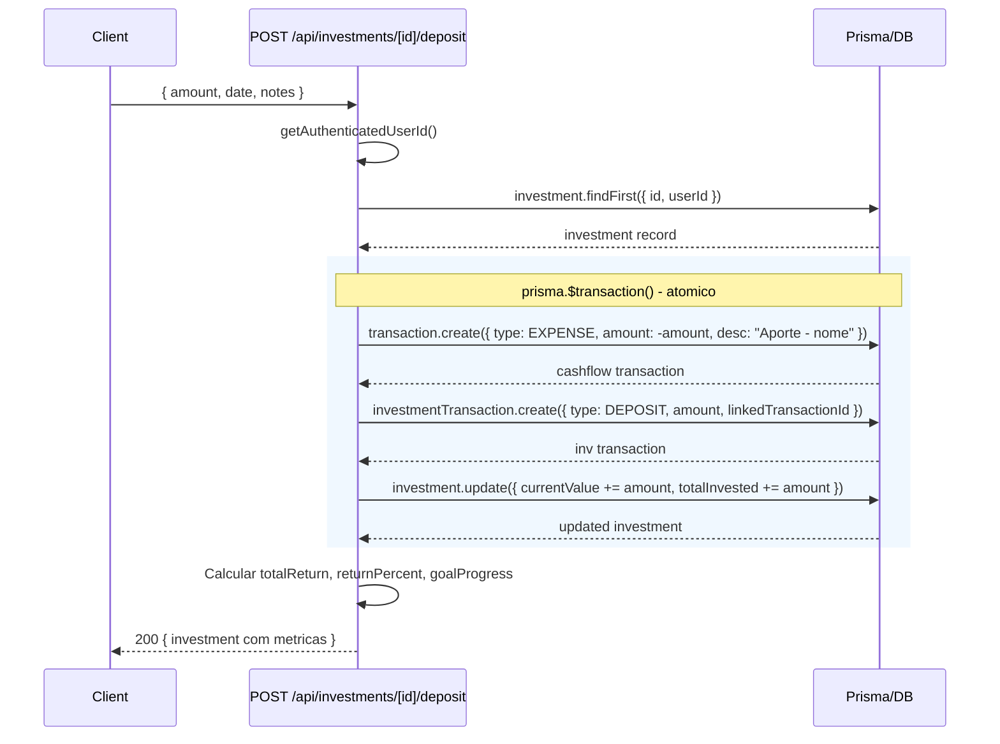
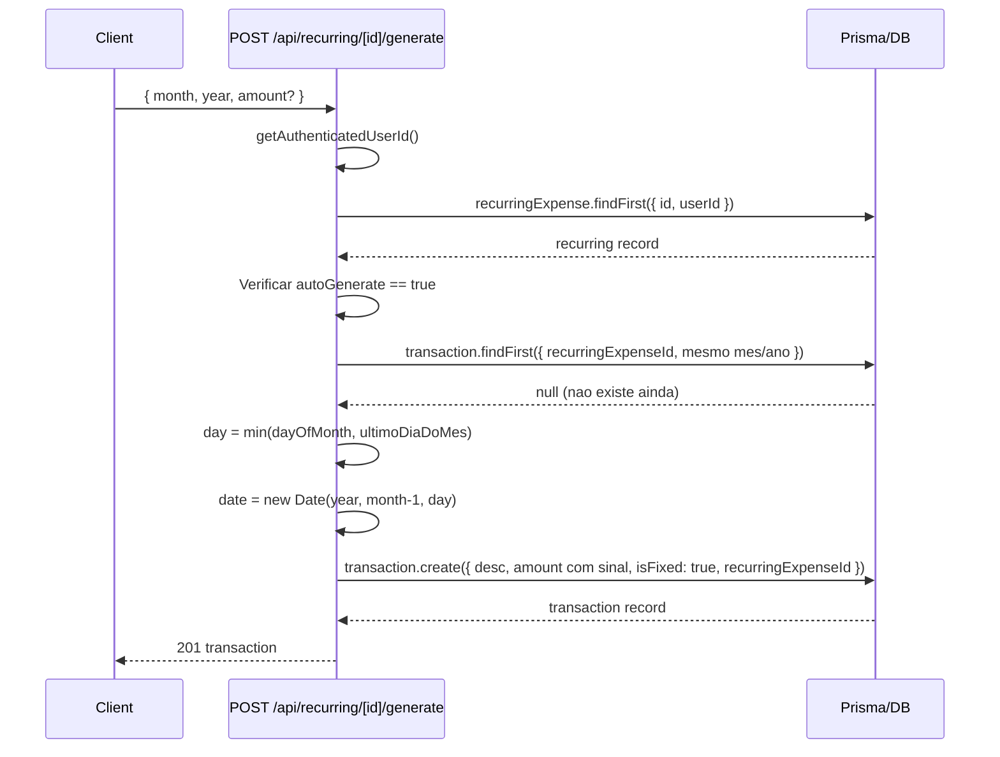
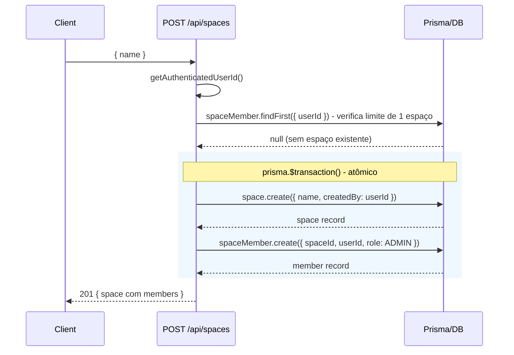
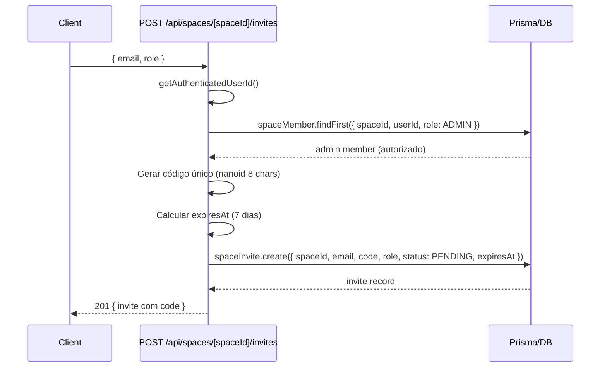
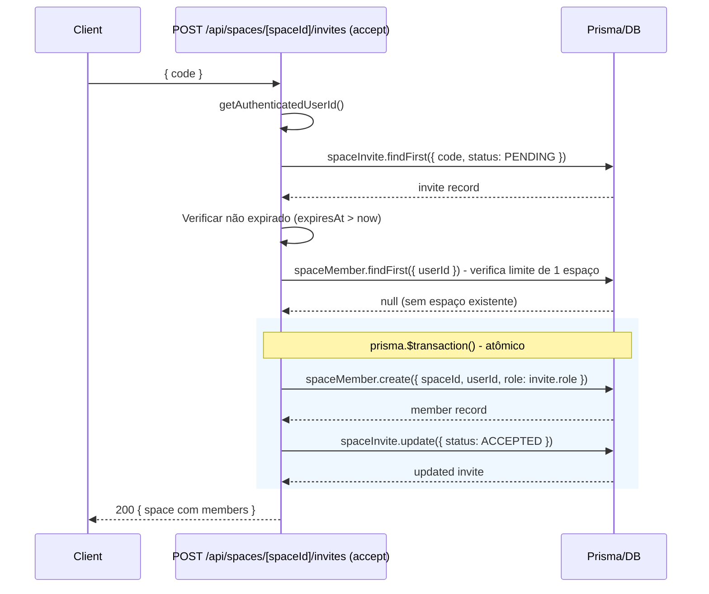
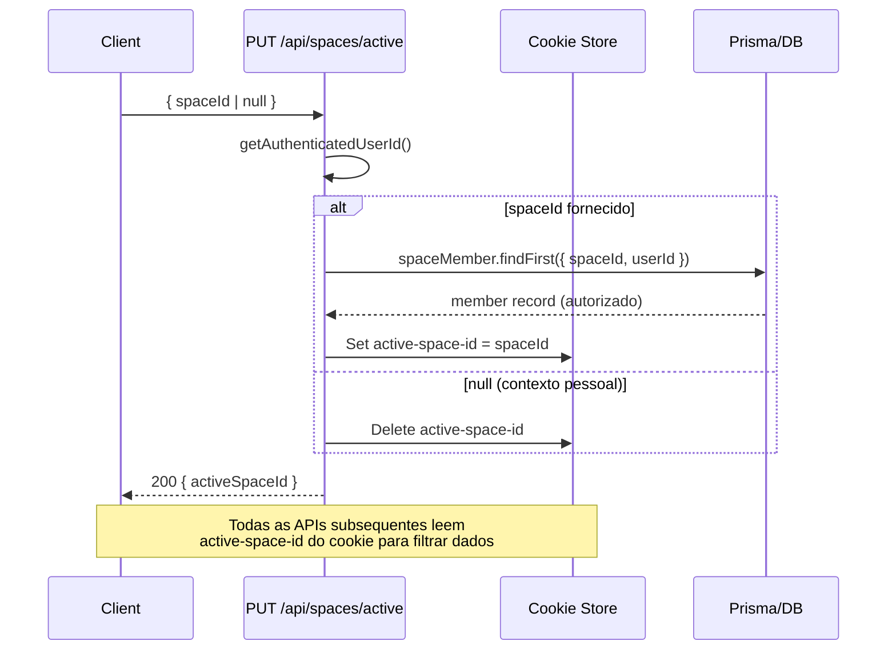
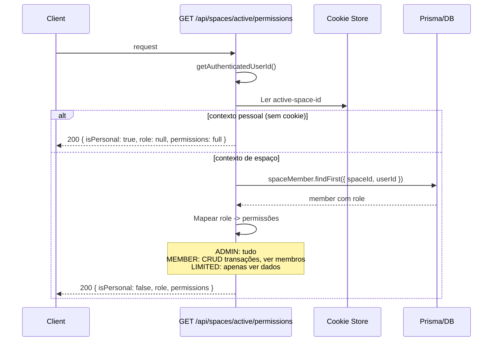

# API Flows - Diagramas de Sequencia

## 1. Criacao de Transacao com Parcelas

## 2. Importacao CSV

## 3. Auto-Categorizacao

## 4. Gestao de Investimentos (Deposito)

## 5. Geracao de Despesas Recorrentes

## 6. Criação de Espaço Compartilhado

## 7. Convite para Espaço

## 8. Aceitar Convite

## 9. Alternância de Contexto (Pessoal / Espaço)

## 10. Verificação de Permissões por Role

Dez fluxos principais da aplicação. Transações com parcelas usam fan-out loop para criar N registros. Importação CSV faz detecção de banco, auto-categorização e linking com recorrentes. Investimentos usam transações atômicas (prisma.$transaction) para manter consistência entre cash-flow e portfolio. Os fluxos de espaços compartilhados (6-10) cobrem criação, convites, aceitação, alternância de contexto e verificação de permissões por role.
