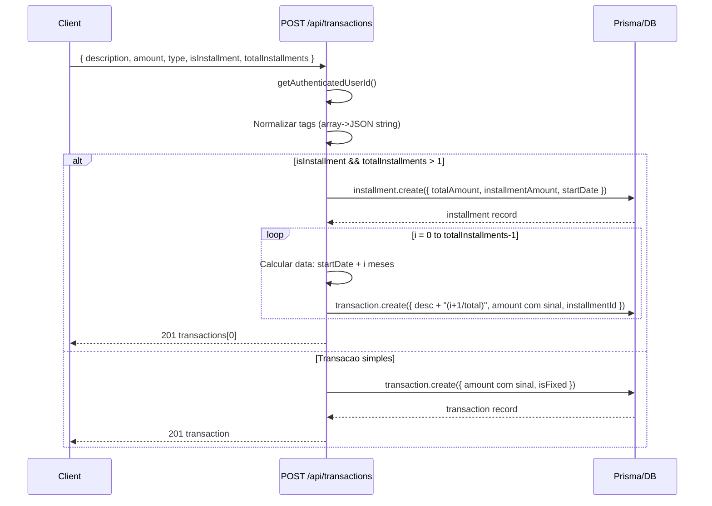
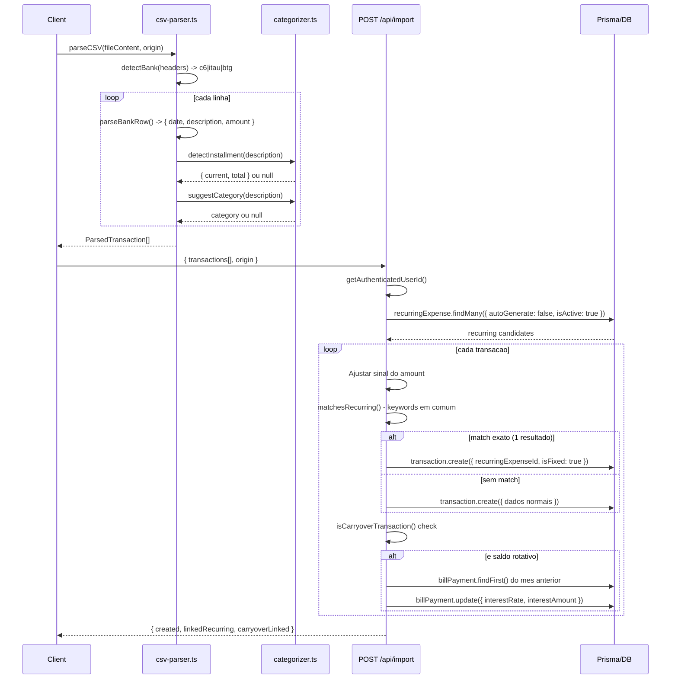
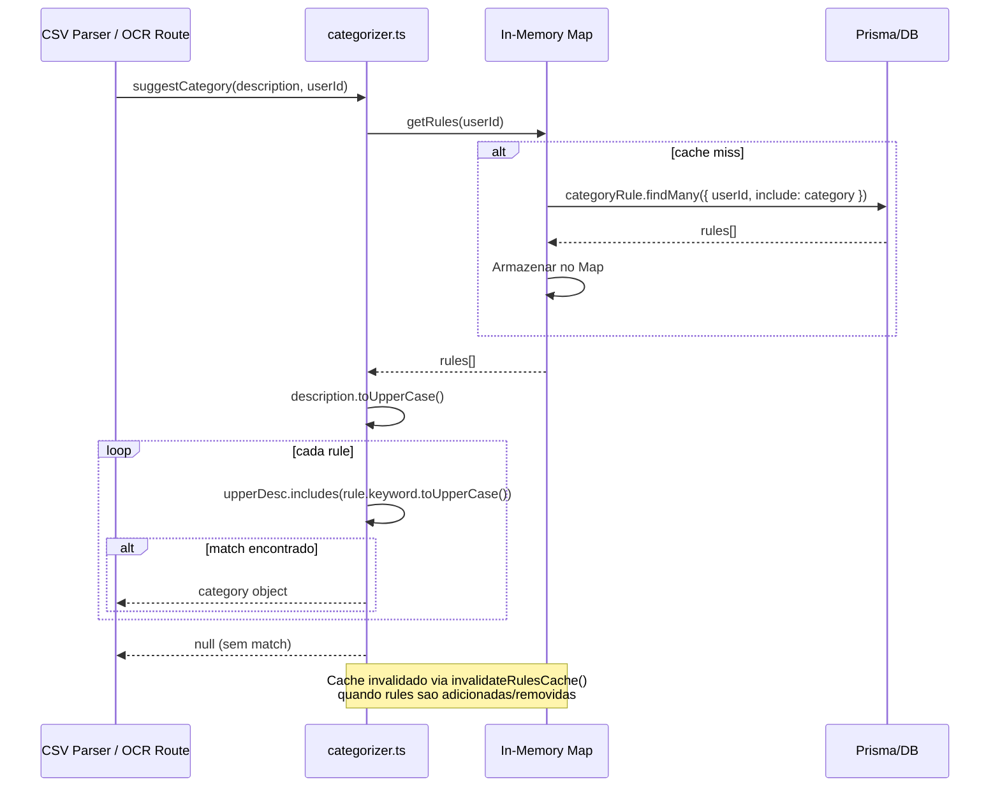
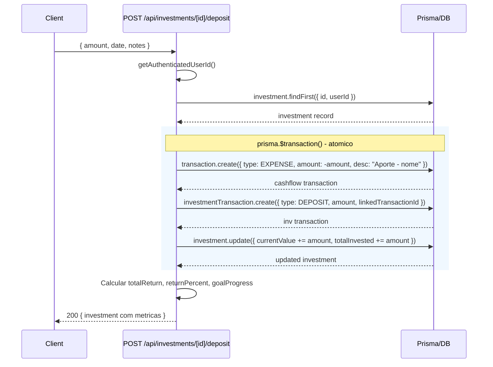
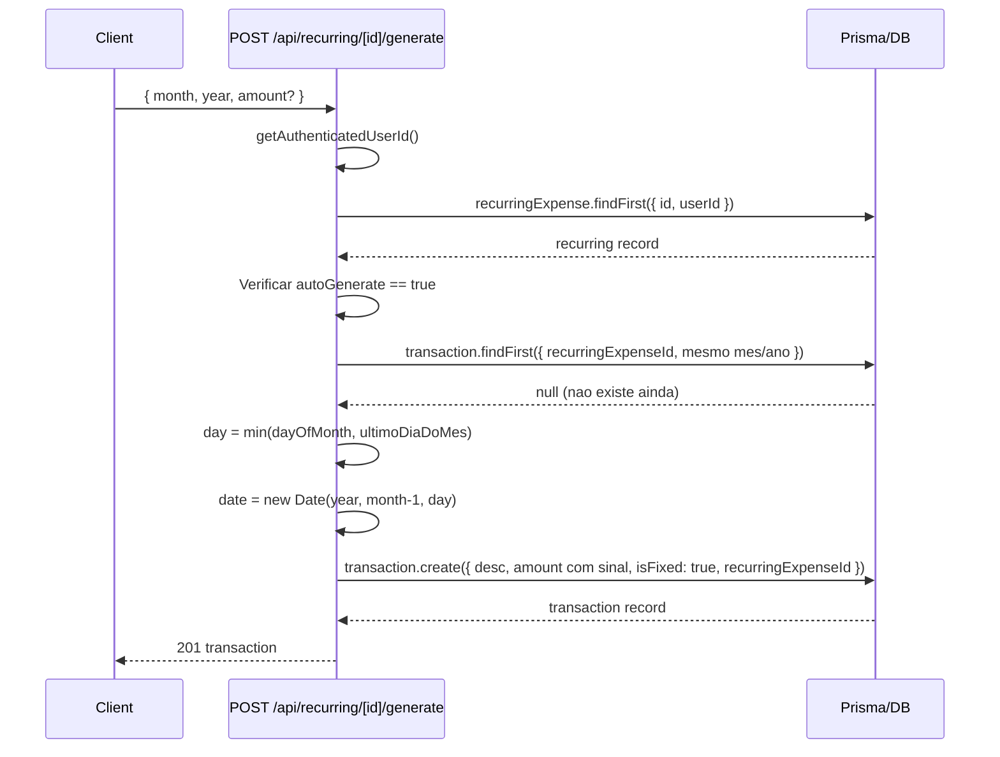

# API Flows - Diagramas de Sequencia

## 1. Criacao de Transacao com Parcelas

## 2. Importacao CSV

## 3. Auto-Categorizacao

## 4. Gestao de Investimentos (Deposito)

## 5. Geracao de Despesas Recorrentes

Cinco fluxos principais da aplicacao. Transacoes com parcelas usam fan-out loop para criar N registros. Importacao CSV faz deteccao de banco, auto-categorizacao e linking com recorrentes. Investimentos usam transacoes atomicas (prisma.$transaction) para manter consistencia entre cash-flow e portfolio.
