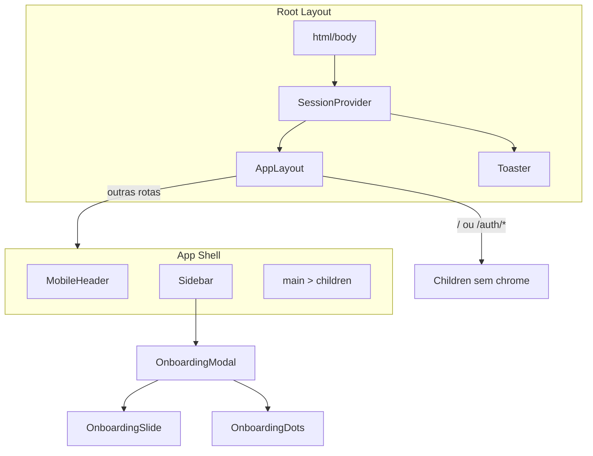
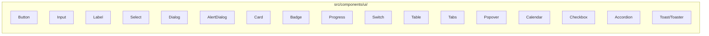

# Component Tree - Hierarquia de Componentes React

## Layout Root

## Paginas e seus Componentes

```mermaid
flowchart TB
    subgraph LANDING["/ Landing Page"]
        LP["LandingPage"]
        LP --> LN["LandingNav"]
        LP --> HS["HeroSection"]
        LP --> FC["FeatureCategories"]
        LP --> HW["HowItWorks"]
        LP --> BN["Benefits"]
        LP --> FAQ["FAQ"]
        LP --> CTA["FinalCTA"]
        LP --> LF["LandingFooter"]
    end

    subgraph DASH["Dashboard"]
        D["Dashboard"]
        D --> CPie["CategoryPieChart"]
        D --> MBar["MonthlyBarChart"]
        D --> OM["OnboardingModal"]
        D --> IDC["InvestmentDashboardCard"]
        IDC --> IPie["InvestmentPieChart"]
    end

    subgraph TRANS["Transactions"]
        TP["TransactionsPage"]
        TP --> TF["TransactionForm"]
        TP --> DRP["DateRangePicker"]
        TP --> FD["FilterDrawer"]
    end

    subgraph INV["Investments"]
        IP["InvestmentsPage"]
        IP --> IC["InvestmentCard"]
        IC --> ICB["InvestmentCategoryBadge"]
        IP --> IF["InvestmentForm"]
        IDP["InvestmentDetailPage"]
    end

    subgraph SIM["Simulador"]
        SP2["SimuladorPage"]
        SP2 --> SF["SimulationForm"]
        SP2 --> SC["SimulationChips"]
        SP2 --> ISC["ImpactSummaryCards"]
        SP2 --> ICH["ImpactChart"]
        SP2 --> SCO["ScenarioComparison"]
        SP2 --> RPD["RegisterPurchaseDialog"]
        SP2 --> SA["SimulatorActions"]
    end

    subgraph REPORTS["Reports"]
        RP["ReportsPage"]
        RP --> OT["OverviewTab"]
        OT --> CPie2["CategoryPieChart"]
        OT --> MBar2["MonthlyBarChart"]
        RP --> AET["AnnualEvolutionTab"]
        AET --> ACC["AnnualComparisonChart"]
        RP --> ORT["OriginsTab"]
        ORT --> OPC["OriginsPieChart"]
        RP --> IT["InstallmentsTab"]
        IT --> ITC["InstallmentTimelineChart"]
        RP --> CTT["CategoryTrendsTab"]
        CTT --> CTLC["CategoryTrendLineChart"]
        RP --> ST["SavingsTab"]
        ST --> SHC["SavingsHistoryChart"]
        RP --> FVT["FixedVariableTab"]
        FVT --> FVC["FixedVariableChart"]
        RP --> CHT["CalendarHeatmapTab"]
        CHT --> CH["CalendarHeatmap"]
        RP --> IVT["InvestmentsTab"]
        IVT --> IEC["InvestmentEvolutionChart"]
        IVT --> IPie2["InvestmentPieChart"]
        RP --> NWT["NetWorthTab"]
        NWT --> NWC["NetWorthChart"]
        RP --> RGT["RecurringGrowthTab"]
        RGT --> RGC["RecurringGrowthChart"]
    end

    subgraph BILLS["Bills"]
        BP["BillsPage"]
        BP --> BPM["BillPaymentModal"]
    end

    subgraph PROJ["Projection"]
        PP["ProjectionPage"]
        PP --> PC["ProjectionChart"]
    end
```

## UI Primitives (Radix-based)

Hierarquia completa dos componentes React. O root layout envolve tudo em SessionProvider > AppLayout > Toaster. AppLayout renderiza Sidebar + MobileHeader para rotas autenticadas. Paginas complexas (Dashboard, Reports, Simulador) compoe feature components especificos, enquanto paginas simples (Categories, Settings, Trash) usam apenas UI primitives diretamente.
