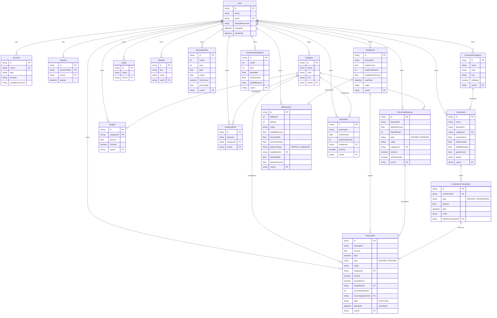

# Data Models - Diagrama ER

Diagrama ER completo das 20 entidades Prisma. User e o hub central com relacionamentos 1:N para quase todas as entidades de dominio. Transaction e a entidade mais conectada, podendo pertencer a Category, Installment e RecurringExpense. O dominio de investimentos tem sua propria hierarquia (InvestmentCategory > Investment > InvestmentTransaction) com link para Transaction via linkedTransactionId.
