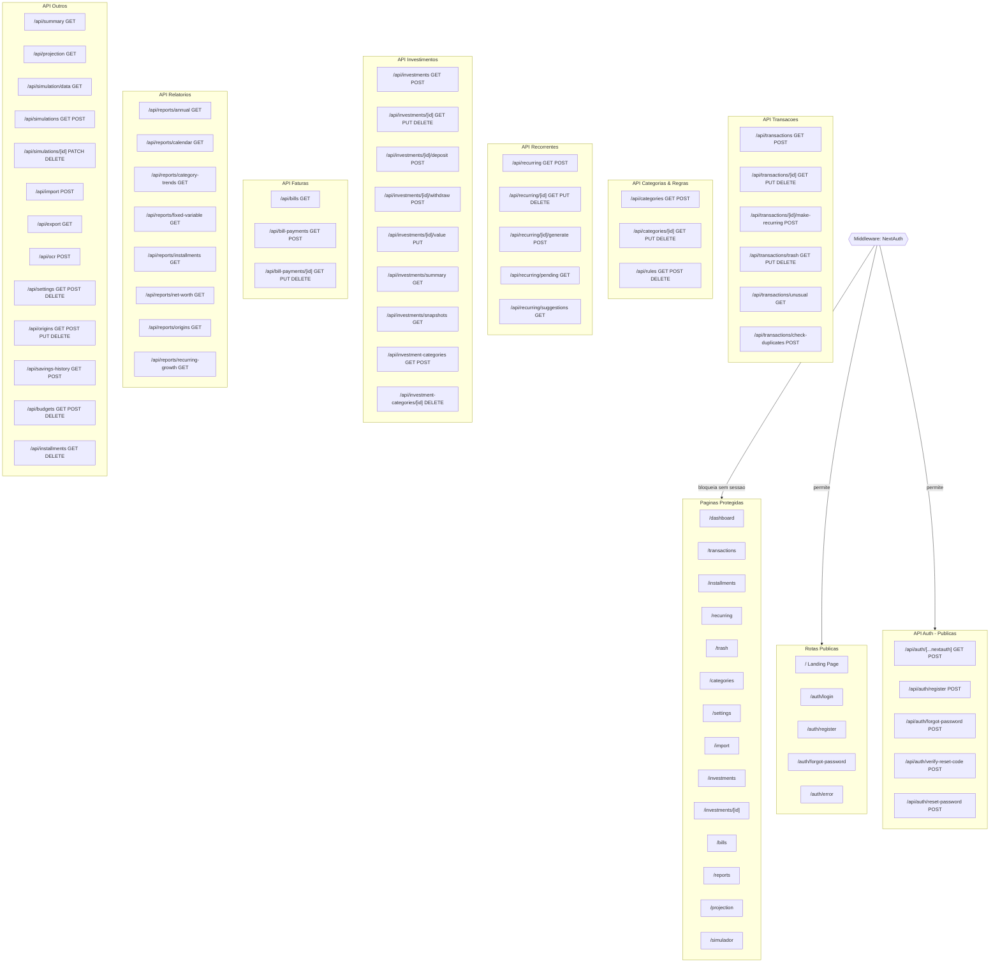

# Route Structure - Mapa de Rotas

Mapa completo de rotas: 5 paginas publicas, 14 protegidas, 5 endpoints de API publicos (auth) e 46 protegidos. O middleware NextAuth intercepta todas as requisicoes e redireciona usuarios nao autenticados para /auth/login. Endpoints protegidos tambem validam sessao via getAuthenticatedUserId().
